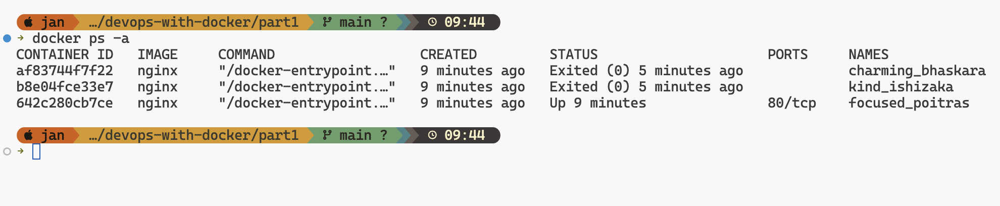
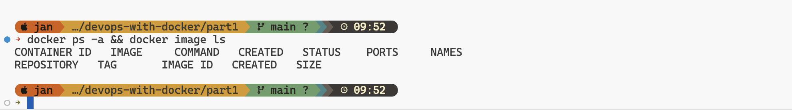
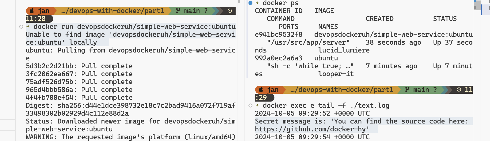
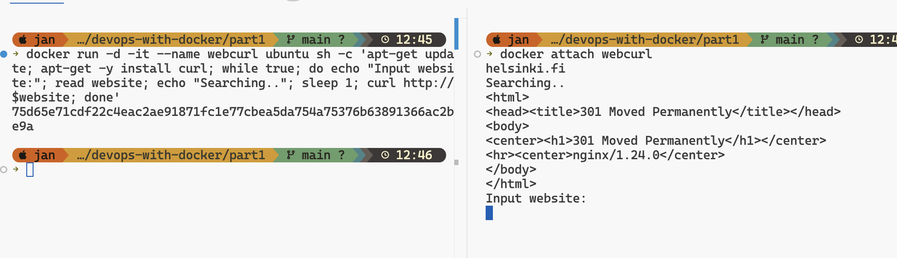

# Devops with Docker - Exercices PART 1

## Exercise 1.1: Getting started

Start 3 containers from an image that does not automatically exit (such as nginx) in detached mode.

Stop two of the containers and leave one container running.

Submit the output for docker ps -a which shows 2 stopped containers and one running.

**Solution**



## Exercise 1.2: Cleanup
We have containers and an image that are no longer in use and are taking up space. Running docker ps -a and docker image ls will confirm this.

Clean the Docker daemon by removing all images and containers.

Submit the output for docker ps -a and docker image ls

**Solution**



## Exercise 1.3: Secret message
Now that we've warmed up it's time to get inside a container while it's running!

Image devopsdockeruh/simple-web-service:ubuntu will start a container that outputs logs into a file. Go inside the running container and use tail -f ./text.log to follow the logs. Every 10 seconds the clock will send you a "secret message".

Submit the secret message and command(s) given as your answer.

**Solution**

```bash
$ docker run devopsdockeruh/simple-web-service:ubuntu
$ docker exec e tail -f ./text.log # e is short for e941bc9532f8
```
Terminal output:
```
Secret message is: 'You can find the source code here: https://github.com/docker-hy'
```



## Exercise 1.4: Missing dependencies
Start a Ubuntu image with the process 
```
sh -c 'while true; do echo "Input website:"; read website; echo "Searching.."; sleep 1; curl http://$website; done'
```

If you're on Windows, you'll want to switch the ' and " around: sh -c "while true; do echo 'Input website:'; read website; echo 'Searching..'; sleep 1; curl http://$website; done".

You will notice that a few things required for proper execution are missing. Be sure to remind yourself which flags to use so that the container actually waits for input.

Note also that curl is NOT installed in the container yet. You will have to install it from inside of the container.

Test inputting helsinki.fi into the application. It should respond with something like
```html
<html>
  <head>
    <title>301 Moved Permanently</title>
  </head>

  <body>
    <h1>Moved Permanently</h1>
    <p>The document has moved <a href="http://www.helsinki.fi/">here</a>.</p>
  </body>
</html>
```

This time return the command you used to start process and the command(s) you used to fix the ensuing problems.

Hint for installing the missing dependencies you could start a new process with docker exec.

This exercise has multiple solutions, if the curl for helsinki.fi works then it's done. Can you figure out other (smart) solutions?

**Solution**

```bash
$ docker run ubuntu -d --it --name curlweb sh -c ' apt-get -y curl && while true; do echo "Input website:"; read website; echo "Searching.."; sleep 1; curl http://$website; done'
```
in another terminal:
```bash
$ docker attach webcurl
```
