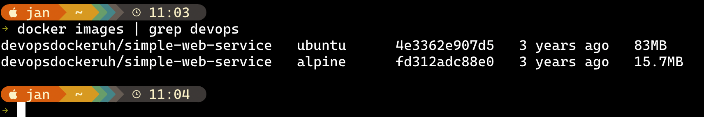
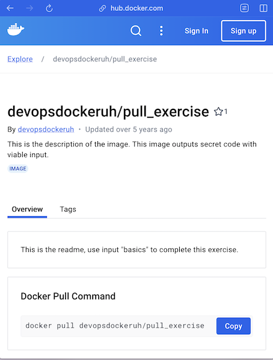
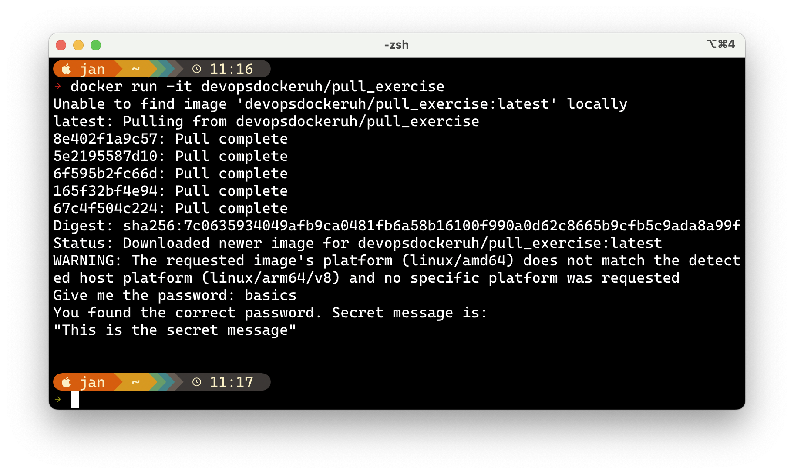
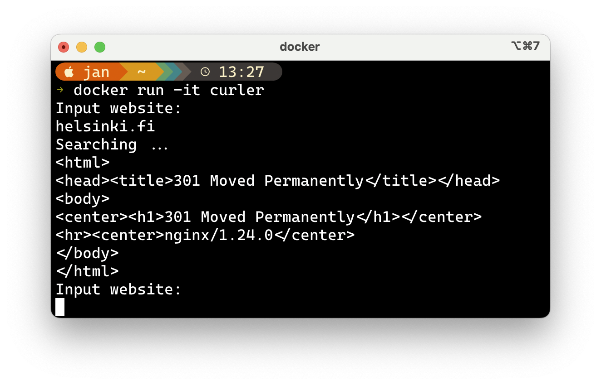

# Devops with Docker - Exercices PART 1

## Exercise 1.1: Getting started

Start 3 containers from an image that does not automatically exit (such as nginx) in detached mode.

Stop two of the containers and leave one container running.

Submit the output for docker ps -a which shows 2 stopped containers and one running.

**Solution**
Screenshot:


## Exercise 1.2: Cleanup
We have containers and an image that are no longer in use and are taking up space. Running docker ps -a and docker image ls will confirm this.

Clean the Docker daemon by removing all images and containers.

Submit the output for docker ps -a and docker image ls

**Solution**
Screenshot:


## Exercise 1.3: Secret message
Now that we've warmed up it's time to get inside a container while it's running!

Image devopsdockeruh/simple-web-service:ubuntu will start a container that outputs logs into a file. Go inside the running container and use tail -f ./text.log to follow the logs. Every 10 seconds the clock will send you a "secret message".

Submit the secret message and command(s) given as your answer.

**Solution**

```bash
$ docker run devopsdockeruh/simple-web-service:ubuntu
$ docker exec e tail -f ./text.log # e is short for e941bc9532f8
```
Terminal output:
```
Secret message is: 'You can find the source code here: https://github.com/docker-hy'
```
Screenshot:


## Exercise 1.4: Missing dependencies
Start a Ubuntu image with the process 
```
sh -c 'while true; do echo "Input website:"; read website; echo "Searching.."; sleep 1; curl http://$website; done'
```

If you're on Windows, you'll want to switch the ' and " around: sh -c "while true; do echo 'Input website:'; read website; echo 'Searching..'; sleep 1; curl http://$website; done".

You will notice that a few things required for proper execution are missing. Be sure to remind yourself which flags to use so that the container actually waits for input.

Note also that curl is NOT installed in the container yet. You will have to install it from inside of the container.

Test inputting helsinki.fi into the application.

This time return the command you used to start process and the command(s) you used to fix the ensuing problems.

Hint for installing the missing dependencies you could start a new process with docker exec.

This exercise has multiple solutions, if the curl for helsinki.fi works then it's done. Can you figure out other (smart) solutions?

**Solution**

```bash
$ docker run ubuntu -d --it --name curlweb sh -c ' apt-get -y curl && while true; do echo "Input website:"; read website; echo "Searching.."; sleep 1; curl http://$website; done'

$ docker attach webcurl
```
Screenshot:


---

## A detailed look into an image

### Exercise 1.5: Sizes of images
In the Exercise 1.3 we used devopsdockeruh/simple-web-service:ubuntu.

Here is the same application but instead of Ubuntu is using Alpine Linux: devopsdockeruh/simple-web-service:alpine.

Pull both images and compare the image sizes. Go inside the Alpine container and make sure the secret message functionality is the same. Alpine version doesn't have bash but it has sh, a more bare-bones shell.

**Solution**

Pulling the images
```bash
$ docker pull devopsdockeruh/simple-web-service:alpine
```

```bash
$ docker pull devopsdockeruh/simple-web-service:ubuntu
```
Image sizes
```bash
$ docker images
```

Running containers
```bash
$ docker image ls
```
Running a shell in the container
```bash
$ docker exec -it a9 sh
```


### Exercise 1.6: Hello Docker Hub
Run docker run -it devopsdockeruh/pull_exercise.

The command will wait for your input.

Navigate through the Docker hub to find the docs and Dockerfile that was used to create the image.

Read the Dockerfile and/or docs to learn what input will get the application to answer a "secret message".

Submit the secret message and command(s) given to get it as your answer.

**Solution**



"This is the secret message"



---

## Building Images

### Exercise 1.7: Image for script
We can improve our previous solutions now that we know how to create and build a Dockerfile.

Let us now get back to Exercise 1.4.

Create a new file script.sh on your local machine with the following contents:
```sh
#!/bin/sh
while true
do
  echo "Input website:"
  read website; echo "Searching.."
  sleep 1; curl http://$website
done
```

Create a Dockerfile for a new image that starts from ubuntu:22.04 and add instructions to install curl into that image. Then add instructions to copy the script file into that image and finally set it to run on container start using CMD.

After you have filled the Dockerfile, build the image with the name "curler".


**Solution**
```dockerfile
FROM ubuntu:22.04

RUN	apt-get update; \
	apt-get install -y curl
WORKDIR /usr/local/bin
COPY ./script.sh .

CMD ["./script.sh"]
```
Build

```bash
$ docker build . -t curler 
```


Sample run



