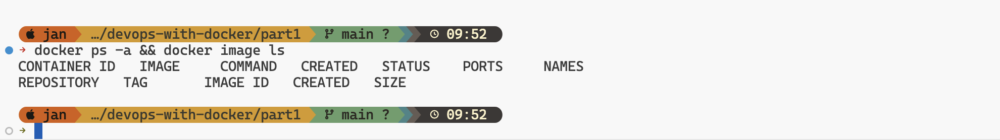

# Devops with Docker - Exercises PART 1

- [Devops with Docker - Exercises PART 1](#devops-with-docker---exercises-part-1)
  - [Exercise 1.1: Getting started](#exercise-11-getting-started)
  - [Exercise 1.2: Cleanup](#exercise-12-cleanup)
  - [Exercise 1.3: Secret message](#exercise-13-secret-message)
  - [Exercise 1.4: Missing dependencies](#exercise-14-missing-dependencies)
  - [A detailed look into an image](#a-detailed-look-into-an-image)
    - [Exercise 1.5: Sizes of images](#exercise-15-sizes-of-images)
    - [Exercise 1.6: Hello Docker Hub](#exercise-16-hello-docker-hub)
  - [Building Images](#building-images)
    - [Exercise 1.7: Image for script](#exercise-17-image-for-script)
    - [Exercise 1.8: Two line Dockerfile](#exercise-18-two-line-dockerfile)
  - [Defining start conditions for the container](#defining-start-conditions-for-the-container)
    - [Exercise 1.9: Volumes](#exercise-19-volumes)
  - [Allowing external connections into containers](#allowing-external-connections-into-containers)
    - [Exercise 1.10: Ports open](#exercise-110-ports-open)
  - [Utilizing tools from the Registry](#utilizing-tools-from-the-registry)
    - [Exercise 1.11: Spring](#exercise-111-spring)
    - [Exercise 1.12: Hello, frontend!](#exercise-112-hello-frontend)
    - [Exercise 1.13: Hello, backend!](#exercise-113-hello-backend)
    - [Mandatory Exercise 1.14: Environment](#mandatory-exercise-114-environment)


## Exercise 1.1: Getting started

Start 3 containers from an image that does not automatically exit (such as nginx) in detached mode.

Stop two of the containers and leave one container running.

Submit the output for docker ps -a which shows 2 stopped containers and one running.

**Solution**
Screenshot:


## Exercise 1.2: Cleanup
We have containers and an image that are no longer in use and are taking up space. Running docker ps -a and docker image ls will confirm this.

Clean the Docker daemon by removing all images and containers.

Submit the output for docker ps -a and docker image ls

**Solution**
Screenshot:


## Exercise 1.3: Secret message
Now that we've warmed up it's time to get inside a container while it's running!

Image devopsdockeruh/simple-web-service:ubuntu will start a container that outputs logs into a file. Go inside the running container and use tail -f ./text.log to follow the logs. Every 10 seconds the clock will send you a "secret message".

Submit the secret message and command(s) given as your answer.

**Solution**

```bash
$ docker run devopsdockeruh/simple-web-service:ubuntu
$ docker exec e tail -f ./text.log # e is short for e941bc9532f8
```
Terminal output:
```
Secret message is: 'You can find the source code here: https://github.com/docker-hy'
```
Screenshot:


## Exercise 1.4: Missing dependencies
Start a Ubuntu image with the process 
```
sh -c 'while true; do echo "Input website:"; read website; echo "Searching.."; sleep 1; curl http://$website; done'
```

If you're on Windows, you'll want to switch the ' and " around: sh -c "while true; do echo 'Input website:'; read website; echo 'Searching..'; sleep 1; curl http://$website; done".

You will notice that a few things required for proper execution are missing. Be sure to remind yourself which flags to use so that the container actually waits for input.

Note also that curl is NOT installed in the container yet. You will have to install it from inside of the container.

Test inputting helsinki.fi into the application.

This time return the command you used to start process and the command(s) you used to fix the ensuing problems.

Hint for installing the missing dependencies you could start a new process with docker exec.

This exercise has multiple solutions, if the curl for helsinki.fi works then it's done. Can you figure out other (smart) solutions?

**Solution**

```bash
$ docker run ubuntu -d --it --name curlweb sh -c ' apt-get -y curl && while true; do echo "Input website:"; read website; echo "Searching.."; sleep 1; curl http://$website; done'

$ docker attach webcurl
```
Screenshot:


---

## A detailed look into an image

### Exercise 1.5: Sizes of images
In the Exercise 1.3 we used devopsdockeruh/simple-web-service:ubuntu.

Here is the same application but instead of Ubuntu is using Alpine Linux: devopsdockeruh/simple-web-service:alpine.

Pull both images and compare the image sizes. Go inside the Alpine container and make sure the secret message functionality is the same. Alpine version doesn't have bash but it has sh, a more bare-bones shell.

**Solution**

Pulling the images
```bash
$ docker pull devopsdockeruh/simple-web-service:alpine
```

```bash
$ docker pull devopsdockeruh/simple-web-service:ubuntu
```
Image sizes
```bash
$ docker images
```

Running containers
```bash
$ docker image ls
```
Running a shell in the container
```bash
$ docker exec -it a9 sh
```


### Exercise 1.6: Hello Docker Hub
Run docker run -it devopsdockeruh/pull_exercise.

The command will wait for your input.

Navigate through the Docker hub to find the docs and Dockerfile that was used to create the image.

Read the Dockerfile and/or docs to learn what input will get the application to answer a "secret message".

Submit the secret message and command(s) given to get it as your answer.

**Solution**


"This is the secret message"


---

## Building Images

### Exercise 1.7: Image for script
We can improve our previous solutions now that we know how to create and build a Dockerfile.

Let us now get back to Exercise 1.4.

Create a new file script.sh on your local machine with the following contents:
```sh
#!/bin/sh
while true
do
  echo "Input website:"
  read website; echo "Searching.."
  sleep 1; curl http://$website
done
```

Create a Dockerfile for a new image that starts from ubuntu:22.04 and add instructions to install curl into that image. Then add instructions to copy the script file into that image and finally set it to run on container start using CMD.

After you have filled the Dockerfile, build the image with the name "curler".


**Solution**
```dockerfile
FROM ubuntu:22.04

RUN	apt-get update; \
	apt-get install -y curl
WORKDIR /usr/local/bin
COPY ./script.sh .

CMD ["./script.sh"]
```
Build

```bash
$ docker build . -t curler 
```


Sample run


### Exercise 1.8: Two line Dockerfile

By default our devopsdockeruh/simple-web-service:alpine doesn't have a CMD. Instead, it uses ENTRYPOINT to declare which application is run.


As you might've noticed it doesn't start the web service even though the name is "simple-web-service". A suitable argument is needed to start the server!


Try docker run devopsdockeruh/simple-web-service:alpine hello. The application reads the argument "hello" but will inform that hello isn't accepted.

In this exercise create a Dockerfile and use FROM and CMD to create a brand new image that automatically runs server.

**Solution**
```Dockerfile
FROM devopsdockeruh/simple-web-service:alpine
CMD ["server"]
```


---
## Defining start conditions for the container

### Exercise 1.9: Volumes

Image devopsdockeruh/simple-web-service creates a timestamp every two seconds to /usr/src/app/text.log when it's not given a command. Start the container with a bind mount so that the logs are created into your filesystem.

**Solution**

```d  
touch text.log && docker run -v "$(pwd)/text.log:/usr/src/app/text.log" devopsdockeruh/simple-web-service
```


---
## Allowing external connections into containers

### Exercise 1.10: Ports open
In this exercise, we won't create a new Dockerfile.

The image devopsdockeruh/simple-web-service will start a web service in port 8080 when given the argument "server". In Exercise 1.8 you already did an image that can be used to run the web service without any argument.

Use now the -p flag to access the contents with your browser. The output to your browser should be something like: { message: "You connected to the following path: ...

Submit your used commands for this exercise.

**Solution**

Running the container
```bash
$ docker run -p 127.0.0.1:8888:8080 devopsdockeruh/simple-web-service server
```
Accessing the server
```bash
$ curl localhost:8888 example.com
```


---
## Utilizing tools from the Registry

### Exercise 1.11: Spring

Create a Dockerfile for an old Java Spring project that can be found from the course repository.

The setup should be straightforward with the README instructions. Tips to get you started:

There are many options for running Java, you may use eg. amazoncorretto FROM amazoncorretto:_tag_ to get Java instead of installing it manually. Pick the tag by using the README and Docker Hub page.

You've completed the exercise when you see a 'Success' message in your browser.

Submit the Dockerfile you used to run the container.

**Solution**

```dockerfile
FROM amazoncorretto:8

EXPOSE 8080

WORKDIR /usr/src/app

COPY . .

RUN ./mvnw package

CMD ["java", "-jar", "./target/docker-example-1.1.3.jar"]
```

build and run:
```bash
$ docker build . -t javaspringapp 

$ docker run -d -p 8080:8080 javaspringapp
```
### Exercise 1.12: Hello, frontend!
A good developer creates well-written READMEs. Such that they can be used to create Dockerfiles with ease.

Clone, fork or download the project from https://github.com/docker-hy/material-applications/tree/main/example-frontend.

Create a Dockerfile for the project (example-frontend) and give a command so that the project runs in a Docker container with port 5000 exposed and published so when you start the container and navigate to http://localhost:5000 you will see message if you're successful.

note that the port 5000 is reserved in the more recent OSX versions (Monterey, Big Sur), so you have to use some other host port
Submit the Dockerfile.

As in other exercises, do not alter the code of the project

TIPS:

The project has install instructions in README.
Note that the app starts to accept connections when "Accepting connections at http://localhost:5000" has been printed to the screen, this takes a few seconds
You do not have to install anything new outside containers.
The project might not work with too new Node.js versions

**Solution**

Dockerfile
```dockerfile
FROM node:16

EXPOSE 5000

WORKDIR /app

COPY package*.json ./

RUN npm install

COPY . .

RUN npx browserslist@latest --update-db

RUN npm run build

RUN npm install -g serve

CMD ["serve", "-s", "-l", "5000", "build"]
```

Build command

```bash
docker build . -t example-frontend 
```

Run command 

```bash
docker run -d -p 5555:5000 example-frontend
```

### Exercise 1.13: Hello, backend!

Clone, fork or download a project from https://github.com/docker-hy/material-applications/tree/main/example-backend.

Create a Dockerfile for the project (example-backend). Start the container with port 8080 published.

When you start the container and navigate to http://localhost:8080/ping you should get a "pong" as a response.

Submit the Dockerfile and the command used.

Do not alter the code of the project


**Solution**

Dockerfile

```dockerfile
FROM golang:1.16.14-buster

EXPOSE 8080

WORKDIR /go/src/app

COPY . .

RUN go build

CMD ["./server"]
```

Build command
```bash
docker build . -t example-backend
```

Run command

```bash
docker run -d -p 8080:8080 example-backend
```

### Mandatory Exercise 1.14: Environment
Start both the frontend and the backend with the correct ports exposed and add ENV to Dockerfile with the necessary information from both READMEs (front, back).

Submit the edited Dockerfiles and commands used to run.

**Solution**

Backend Dockerfile
```dockerfile
FROM golang:1.16.14-buster

EXPOSE 8080

WORKDIR /go/src/app

COPY . .

RUN go build

ENV PORT=8080
ENV REQUEST_ORIGIN=http://localhost:5555

CMD ["./server"]
```

Frontend Dockerfile

```dockerfile
FROM node:16

EXPOSE 5000

WORKDIR /app

COPY package*.json ./

RUN npm install

COPY . .

RUN npx browserslist@latest --update-db

RUN npm run build

RUN npm install -g serve

ENV REACT_APP_BACKEND_URL=http://localhost:8080/

RUN  ["npm", "run", "build"]

CMD ["serve", "-s", "-l", "5000", "build"]
```

Run backend
```bash
docker build . -t example-backend
docker run -p 8080:8080 example-backend 
```

Run frontend
```bash
docker build . -t example-frontend 
docker run -p 5555:5000 example-frontend
```
