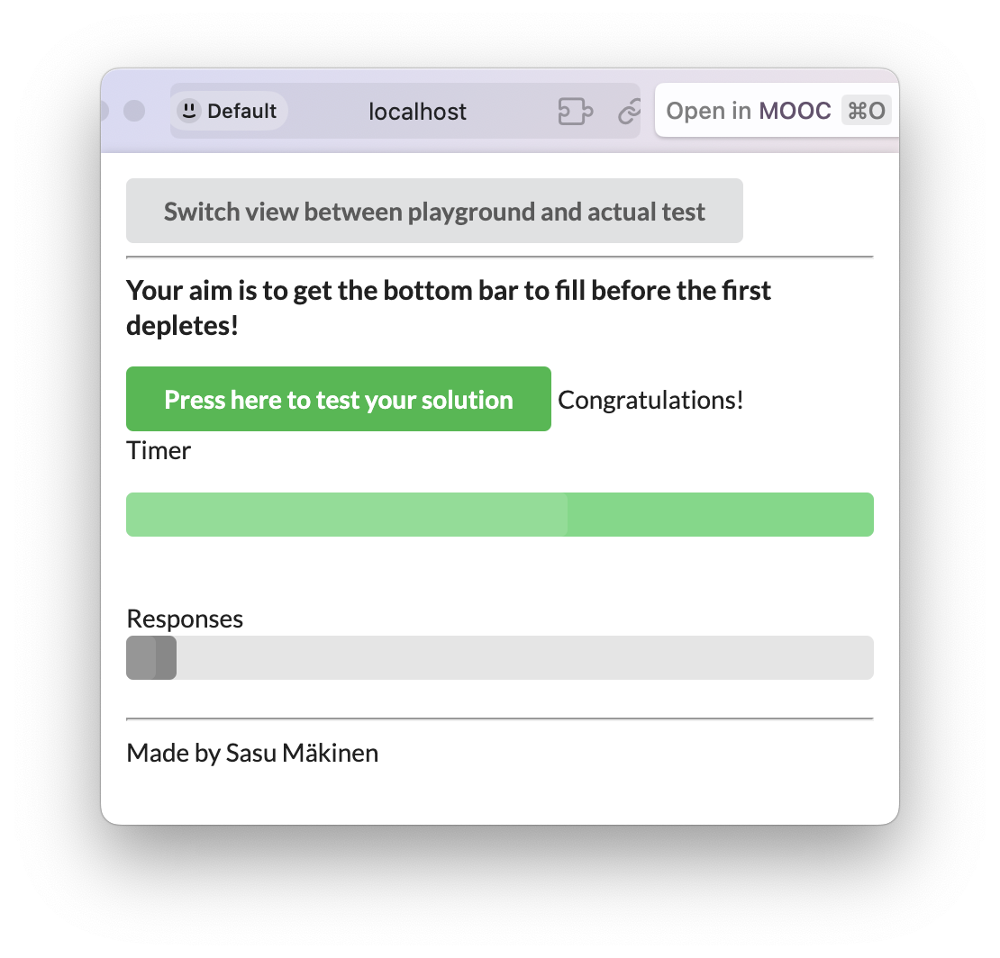

# DevOps with Docker - Exercises PART 2

- [DevOps with Docker - Exercises PART 2](#devops-with-docker---exercises-part-2)
  - [Migrating to Docker Compose](#migrating-to-docker-compose)
    - [Exercise 2.1](#exercise-21)
    - [Exercise 2.2](#exercise-22)
    - [Exercise 2.3](#exercise-23)
  - [Docker Networking](#docker-networking)
    - [Exercise 2.4](#exercise-24)
    - [Exercise 2.5](#exercise-25)
  - [Volumes im action](#volumes-im-action)
    - [Exercise 2.6](#exercise-26)
    - [Exercise 2.7](#exercise-27)

## Migrating to Docker Compose

### Exercise 2.1
Let us now leverage the Docker Compose with the simple webservice that we used in the Exercise 1.3

Without a command devopsdockeruh/simple-web-service will create logs into its /usr/src/app/text.log.

Create a docker-compose.yml file that starts devopsdockeruh/simple-web-service and saves the logs into your filesystem.

Submit the docker-compose.yml, and make sure that it works simply by running docker compose up if the log file exists.

**Solution**
```yml
name: ex2_1-simple-web-service

services:
  simple-web-service:
    image: devopsdockeruh/simple-web-service
    ports:
      - "8080:8080"
    volumes:
      # bind log file to a local file.
      # file text.log must exist (touch text.log)
      - ./text.log:/usr/src/app/text.log
```

### Exercise 2.2

Read about how to add the command to docker-compose.yml from the documentation.

The familiar image devopsdockeruh/simple-web-service can be used to start a web service, see the exercise 1.10.

Create a docker-compose.yml, and use it to start the service so that you can use it with your browser.

Submit the docker-compose.yml, and make sure that it works simply by running docker compose up

**Solution**

```yml
name: ex2_2-simple-web-service

services:
  simple-web-service:
    image: devopsdockeruh/simple-web-service
    ports:
      - "8080:8080"
    command: server
```

### Exercise 2.3
As we saw previously, starting an application with two programs was not trivial and the commands got a bit long.

In the previous part we created Dockerfiles for both frontend and backend of the example application. Next, simplify the usage into one docker-compose.yml.

Configure the backend and frontend from part 1 to work in Docker Compose.

Submit the docker-compose.yml

**Solution**

```yml
name: example-front-and-back

services:
  example-frontend:
    build: example-frontend
    image: example-frontend  
    restart: "no"
    ports:
      - 5555:5000 
    depends_on:
      - example-backend
  
  example-backend:
    build: example-backend
    image: example-backend
    restart: "no"
    ports:
      - 8080:8080
```

---

## Docker Networking

### Exercise 2.4
In this exercise you should expand the configuration done in Exercise 2.3 and set up the example backend to use the key-value database Redis.

Redis is quite often used as a cache to store data so that future requests for data can be served faster.

The backend uses a slow API to fetch some information. You can test the slow API by requesting /ping?redis=true with curl. The frontend app has a button to test this.

So you should improve the performance of the app and configure a Redis container to cache information for the backend. The documentation of the Redis image might contain some useful info.

The backend README should have all the information that is needed for configuring the backend.

When you've correctly configured the button will turn green.

Submit the docker-compose.yml


**Solution**

```yml
name: example-front-and-back

services:
  example-frontend:
    build: example-frontend
    image: example-frontend  
    restart: "no"
    ports:
      - 5555:5000 
    depends_on:
      - example-backend
  
  example-backend:
    build: example-backend
    image: example-backend
    restart: "no"
    depends_on:
      - redis
    ports:
      - 8080:8080
    environment:
      - REDIS_HOST=redis
      - PORT=8080
      - REQUEST_ORIGIN=http://localhost:5555
  
  redis:
    image: redis
    restart: "unless-stopped"
    
```

### Exercise 2.5
The project https://github.com/docker-hy/material-applications/tree/main/scaling-exercise is a barely working application. Go ahead and clone it for yourself. The project already includes docker-compose.yml so you can start it by running docker compose up.

The application should be accessible through http://localhost:3000. However it doesn't work well enough and we've added a load balancer for scaling. Your task is to scale the compute containers so that the button in the application turns green.

This exercise was created with Sasu Mäkinen

Please return the used commands for this exercise.

**Solution**

The excercise can be solved by adding compute instances. This will distribute the load between the compute containers.
On a M1 Mac it was enough to have 2 compute instances for the load to be balanced.
```bash
docker compose up --scale compute=2 
```



---

## Volumes im action

### Exercise 2.6

Let us continue with the example app that we worked with in Exercise 2.4.

Now you should add a database to the example backend.

Use a Postgres database to save messages. For now, there is no need to configure a volume since the official Postgres image sets a default volume for us. Use the Postgres image documentation to your advantage when configuring: https://hub.docker.com/_/postgres/. Especially part Environment Variables is a valuable one.

The backend README should have all the information needed to connect.

There is again a button (and a form!) in the frontend that you can use to ensure your configuration is done right.

Submit the docker-compose.yml

TIPS:

When configuring the database, you might need to destroy the automatically created volumes. Use commands docker volume prune, docker volume ls and docker volume rm to remove unused volumes when testing. Make sure to remove containers that depend on them beforehand.
restart: unless-stopped can help if the Postgres takes a while to get ready
Backend, frontend, redis and a database

**Solution**


```properties
# .env file
# Database configuration for PostgreSQL 
POSTGRES_USER=postgres
POSTGRES_PASSWORD=postgres
POSTGRES_DB=postgres
```

```yml
# docker-compose.yml
name: example-front-and-back

services:

  db:
    image: postgres:13.2-alpine
    restart: unless-stopped
    env_file:
      - .env

  example-frontend:
    build: example-frontend
    image: example-frontend  
    restart: "no"
    ports:
      - 5555:5000 
    depends_on:
      - example-backend
  
  example-backend:
    build: example-backend
    image: example-backend
    restart: "no"
    depends_on:
      - redis
      - db
    ports:
      - 8080:8080
    environment:
      - REDIS_HOST=redis
      - POSTGRES_HOST=db
      - PORT=8080
      - REQUEST_ORIGIN=http://localhost:5555
    env_file:
      - .env

  redis:
    image: redis
    restart: "unless-stopped"    
```

### Exercise 2.7
Postgres image uses a volume by default. Define manually a volume for the database in a convenient location such as in ./database so you should use now a bind mount. The image documentation may help you with the task.

After you have configured the bind mount volume:

Save a few messages through the frontend
Run docker compose down
Run docker compose up and see that the messages are available after refreshing browser
Run docker compose down and delete the volume folder manually
Run docker compose up and the data should be gone
TIP: To save you the trouble of testing all of those steps, just look into the folder before trying the steps. If it's empty after docker compose up then something is wrong.

Submit the docker-compose.yml

The benefit of a bind mount is that since you know exactly where the data is in your file system, it is easy to create backups. If the Docker managed volumes are used, the location of the data in the file system can not be controlled and that makes backups a bit less trivial...

**Solution**

```yml
# docker-compose.yml
name: example-front-and-back

services:

  db:
    image: postgres:13.2-alpine
    restart: unless-stopped
    volumes:
      - ./database:/var/lib/postgresql/data    # <---- bind mount
    env_file:
      - .env

  example-frontend:
    build: example-frontend
    image: example-frontend  
    restart: "no"
    ports:
      - 5555:5000 
    depends_on:
      - example-backend
  
  example-backend:
    build: example-backend
    image: example-backend
    restart: "no"
    depends_on:
      - redis
      - db
    ports:
      - 8080:8080
    environment:
      - REDIS_HOST=redis
      - POSTGRES_HOST=db
      - PORT=8080
      - REQUEST_ORIGIN=http://localhost:5555
    env_file:
      - .env

  redis:
    image: redis
    restart: "unless-stopped"    
```