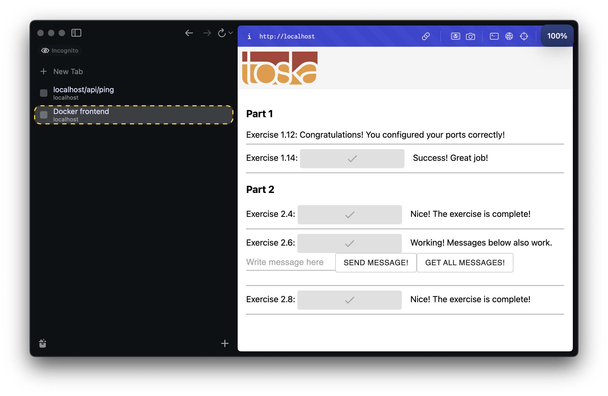
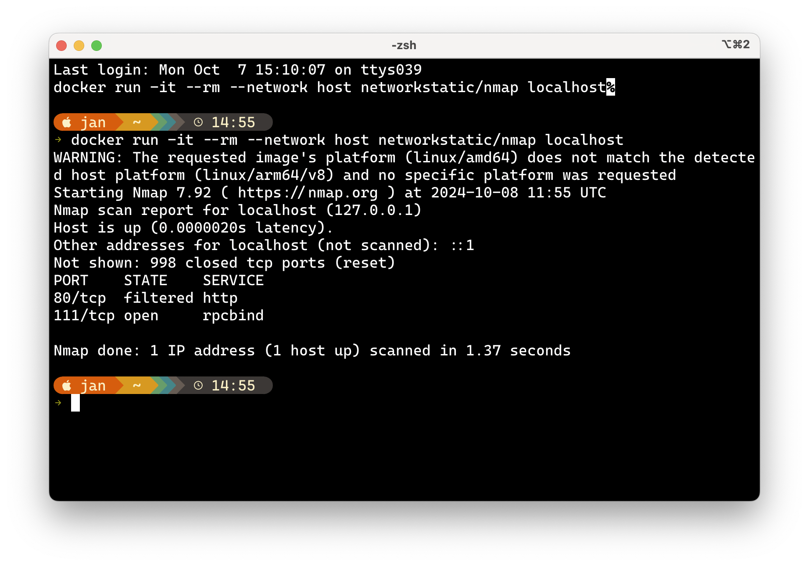

# DevOps with Docker - Exercises PART 2

- [DevOps with Docker - Exercises PART 2](#devops-with-docker---exercises-part-2)
  - [Migrating to Docker Compose](#migrating-to-docker-compose)
    - [Exercise 2.1](#exercise-21)
    - [Exercise 2.2](#exercise-22)
    - [Exercise 2.3](#exercise-23)
  - [Docker Networking](#docker-networking)
    - [Exercise 2.4](#exercise-24)
    - [Exercise 2.5](#exercise-25)
  - [Volumes im action](#volumes-im-action)
    - [Exercise 2.6](#exercise-26)
    - [Exercise 2.7](#exercise-27)
    - [Exercise 2.8](#exercise-28)
    - [Exercise 2.9](#exercise-29)
    - [Exercise 2.10](#exercise-210)
  - [Containers in Development](#containers-in-development)
    - [TODO \>\>\>\>\> Exercise 2.11](#todo--exercise-211)

## Migrating to Docker Compose

### Exercise 2.1
Let us now leverage the Docker Compose with the simple webservice that we used in the Exercise 1.3

Without a command devopsdockeruh/simple-web-service will create logs into its /usr/src/app/text.log.

Create a docker-compose.yml file that starts devopsdockeruh/simple-web-service and saves the logs into your filesystem.

Submit the docker-compose.yml, and make sure that it works simply by running docker compose up if the log file exists.

**Solution**
```yml
name: ex2_1-simple-web-service

services:
  simple-web-service:
    image: devopsdockeruh/simple-web-service
    ports:
      - "8080:8080"
    volumes:
      # bind log file to a local file.
      # file text.log must exist (touch text.log)
      - ./text.log:/usr/src/app/text.log
```

### Exercise 2.2

Read about how to add the command to docker-compose.yml from the documentation.

The familiar image devopsdockeruh/simple-web-service can be used to start a web service, see the exercise 1.10.

Create a docker-compose.yml, and use it to start the service so that you can use it with your browser.

Submit the docker-compose.yml, and make sure that it works simply by running docker compose up

**Solution**

```yml
name: ex2_2-simple-web-service

services:
  simple-web-service:
    image: devopsdockeruh/simple-web-service
    ports:
      - "8080:8080"
    command: server
```

### Exercise 2.3
As we saw previously, starting an application with two programs was not trivial and the commands got a bit long.

In the previous part we created Dockerfiles for both frontend and backend of the example application. Next, simplify the usage into one docker-compose.yml.

Configure the backend and frontend from part 1 to work in Docker Compose.

Submit the docker-compose.yml

**Solution**

```yml
name: example-front-and-back

services:
  example-frontend:
    build: example-frontend
    image: example-frontend  
    restart: "no"
    ports:
      - 5555:5000 
    depends_on:
      - example-backend
  
  example-backend:
    build: example-backend
    image: example-backend
    restart: "no"
    ports:
      - 8080:8080
```

---

## Docker Networking

### Exercise 2.4
In this exercise you should expand the configuration done in Exercise 2.3 and set up the example backend to use the key-value database Redis.

Redis is quite often used as a cache to store data so that future requests for data can be served faster.

The backend uses a slow API to fetch some information. You can test the slow API by requesting /ping?redis=true with curl. The frontend app has a button to test this.

So you should improve the performance of the app and configure a Redis container to cache information for the backend. The documentation of the Redis image might contain some useful info.

The backend README should have all the information that is needed for configuring the backend.

When you've correctly configured the button will turn green.

Submit the docker-compose.yml


**Solution**

```yml
name: example-front-and-back

services:
  example-frontend:
    build: example-frontend
    image: example-frontend  
    restart: "no"
    ports:
      - 5555:5000 
    depends_on:
      - example-backend
  
  example-backend:
    build: example-backend
    image: example-backend
    restart: "no"
    depends_on:
      - redis
    ports:
      - 8080:8080
    environment:
      - REDIS_HOST=redis
      - PORT=8080
      - REQUEST_ORIGIN=http://localhost:5555
  
  redis:
    image: redis
    restart: "unless-stopped"
    
```

### Exercise 2.5
The project https://github.com/docker-hy/material-applications/tree/main/scaling-exercise is a barely working application. Go ahead and clone it for yourself. The project already includes docker-compose.yml so you can start it by running docker compose up.

The application should be accessible through http://localhost:3000. However it doesn't work well enough and we've added a load balancer for scaling. Your task is to scale the compute containers so that the button in the application turns green.

This exercise was created with Sasu Mäkinen

Please return the used commands for this exercise.

**Solution**

The excercise can be solved by adding compute instances. This will distribute the load between the compute containers.
On a M1 Mac it was enough to have 2 compute instances for the load to be balanced.
```bash
docker compose up --scale compute=2 
```


---

## Volumes im action

### Exercise 2.6

Let us continue with the example app that we worked with in Exercise 2.4.

Now you should add a database to the example backend.

Use a Postgres database to save messages. For now, there is no need to configure a volume since the official Postgres image sets a default volume for us. Use the Postgres image documentation to your advantage when configuring: https://hub.docker.com/_/postgres/. Especially part Environment Variables is a valuable one.

The backend README should have all the information needed to connect.

There is again a button (and a form!) in the frontend that you can use to ensure your configuration is done right.

Submit the docker-compose.yml

TIPS:

When configuring the database, you might need to destroy the automatically created volumes. Use commands docker volume prune, docker volume ls and docker volume rm to remove unused volumes when testing. Make sure to remove containers that depend on them beforehand.
restart: unless-stopped can help if the Postgres takes a while to get ready
Backend, frontend, redis and a database

**Solution**


```properties
# .env file
# Database configuration for PostgreSQL 
POSTGRES_USER=postgres
POSTGRES_PASSWORD=postgres
POSTGRES_DB=postgres
```

```yml
# docker-compose.yml
name: example-front-and-back

services:

  db:
    image: postgres:13.2-alpine
    restart: unless-stopped
    env_file:
      - .env

  example-frontend:
    build: example-frontend
    image: example-frontend  
    restart: "no"
    ports:
      - 5555:5000 
    depends_on:
      - example-backend
  
  example-backend:
    build: example-backend
    image: example-backend
    restart: "no"
    depends_on:
      - redis
      - db
    ports:
      - 8080:8080
    environment:
      - REDIS_HOST=redis
      - POSTGRES_HOST=db
      - PORT=8080
      - REQUEST_ORIGIN=http://localhost:5555
    env_file:
      - .env

  redis:
    image: redis
    restart: "unless-stopped"    
```

### Exercise 2.7
Postgres image uses a volume by default. Define manually a volume for the database in a convenient location such as in ./database so you should use now a bind mount. The image documentation may help you with the task.

After you have configured the bind mount volume:

Save a few messages through the frontend
Run docker compose down
Run docker compose up and see that the messages are available after refreshing browser
Run docker compose down and delete the volume folder manually
Run docker compose up and the data should be gone
TIP: To save you the trouble of testing all of those steps, just look into the folder before trying the steps. If it's empty after docker compose up then something is wrong.

Submit the docker-compose.yml

The benefit of a bind mount is that since you know exactly where the data is in your file system, it is easy to create backups. If the Docker managed volumes are used, the location of the data in the file system can not be controlled and that makes backups a bit less trivial...

**Solution**

```yml
# docker-compose.yml
name: example-front-and-back

services:

  db:
    image: postgres:13.2-alpine
    restart: unless-stopped
    volumes:
      - ./database:/var/lib/postgresql/data    # <---- bind mount
    env_file:
      - .env

  example-frontend:
    build: example-frontend
    image: example-frontend  
    restart: "no"
    ports:
      - 5555:5000 
    depends_on:
      - example-backend
  
  example-backend:
    build: example-backend
    image: example-backend
    restart: "no"
    depends_on:
      - redis
      - db
    ports:
      - 8080:8080
    environment:
      - REDIS_HOST=redis
      - POSTGRES_HOST=db
      - PORT=8080
      - REQUEST_ORIGIN=http://localhost:5555
    env_file:
      - .env

  redis:
    image: redis
    restart: "unless-stopped"    
```

### Exercise 2.8
In this exercise, you shall add Nginx to work as a reverse proxy in front of the example app frontend and backend.

According to Wikipedia a reverse proxy is a type of proxy server that retrieves resources on behalf of a client from one or more servers. These resources are then returned to the client, appearing as if they originated from the reverse proxy server itself.

Backend, frontend, redis, a database and nginx

So in our case, the reverse proxy will be the single point of entry to our application, and the final goal will be to set both the React frontend and the Express backend behind the reverse proxy.

The idea is that a browser makes all requests to http://localhost. If the request has a URL prefix http://localhost/api, Nginx should forward the request to the backend container. All the other requests are directed to the frontend container.

So, at the end, you should see that the frontend is accessible simply by going to http://localhost. All buttons, except the one labeled Exercise 2.8 may have stopped working, do not worry about them, we shall fix that later.

The following file should be set to /etc/nginx/nginx.conf inside the Nginx container. You can use a file bind mount where the contents of the file is the following:
```
events { worker_connections 1024; }

http {
  server {
    listen 80;

    location / {
      proxy_pass _frontend-connection-url_;
    }

    # configure here where requests to http://localhost/api/...
    # are forwarded
    location /api/ {
      proxy_set_header Host $host;
      proxy_pass _backend-connection-url_;
    }
  }
}
```

Nginx, backend and frontend should be connected in the same network. See the image above for how the services are connected. You find Nginx-documentation helpful, but remember, the configuration you need is pretty straightforward, if you end up doing complex things, you are most likely doing something wrong.


Submit the docker-compose.yml

**Solution**

```yml
# docker-compose.yml
name: example-front-and-back

services:

  db:
    image: postgres:13.2-alpine
    restart: unless-stopped
    volumes:
      - ./database:/var/lib/postgresql/data
    env_file:
      - .env

  example-frontend:
    build: example-frontend
    image: example-frontend  
    restart: "no"
    expose:
      - 5000 
    depends_on:
      - example-backend
  
  example-backend:
    build: example-backend
    image: example-backend
    restart: "no"
    depends_on:
      - redis
      - db
    expose:
      - 8080
    environment:
      - REDIS_HOST=redis
      - POSTGRES_HOST=db
      - PORT=8080
      - REQUEST_ORIGIN=http://localhost:5555
    env_file:
      - .env

  redis:
    image: redis
    restart: "unless-stopped"

  nginx:
    image: nginx:latest
    volumes:
      - ./nginx.conf:/etc/nginx/nginx.conf:ro
    depends_on:
      - example-frontend
      - example-backend
    ports:
      - 80:80
```

### Exercise 2.9
Most of the buttons may have stopped working in the example application. Make sure that every button for exercises works.

Remember to take a peek into the browser's developer consoles again like we did back part 1, remember also this and this.

The buttons of the Nginx exercise and the first button behave differently but you want them to match.

If you had to make any changes explain what you did and where.

Submit the docker-compose.yml and both Dockerfiles.

**Solution**

```yml
# docker-compose.yml
name: example-front-and-back

services:

  db:
    image: postgres:13.2-alpine
    restart: unless-stopped
    volumes:
      - ./database:/var/lib/postgresql/data
    env_file:
      - .env

  example-frontend:
    build: example-frontend
    image: example-frontend  
    restart: "no"
    expose:
      - 5000 
    depends_on:
      - example-backend
  
  example-backend:
    build: example-backend
    image: example-backend
    restart: "no"
    depends_on:
      - redis
      - db
    expose:
      - 8080
    environment:
      - REDIS_HOST=redis
      - POSTGRES_HOST=db
      - PORT=8080
      - REQUEST_ORIGIN=http://localhost:5555
    env_file:
      - .env

  redis:
    image: redis
    restart: "unless-stopped"

  nginx:
    image: nginx:latest
    volumes:
      - ./nginx.conf:/etc/nginx/nginx.conf:ro
    depends_on:
      - example-frontend
      - example-backend
    ports:
      - 80:80
```

```dockerfile
#example-frontend/Dockerfile

FROM node:16

EXPOSE 5000

WORKDIR /app

COPY package*.json ./

RUN npm install

COPY . .

RUN npx browserslist@latest --update-db

RUN npm run build

RUN npm install -g serve

ENV REACT_APP_BACKEND_URL=http://localhost/api

RUN  ["npm", "run", "build"]

CMD ["serve", "-s", "-l", "5000", "build"]
```

```dockerfile
# example-backend/Dockerfile

FROM golang:1.16.14-buster

EXPOSE 8080

WORKDIR /go/src/app

COPY . .

RUN go build

CMD ["./server"]
```




### Exercise 2.10
Now we have the reverse proxy up and running! All the communication to our app should be done through the reverse proxy and direct access (eg. accessing the backend with a GET to http://localhost:8080/ping ) should be prevented.

Use a port scanner, eg https://hub.docker.com/r/networkstatic/nmap to ensure that there are no extra ports open in the host.

It might be enough to just run

$ docker run -it --rm --network host networkstatic/nmap localhost

If you have an M1/M2 Mac, you might need to build the image yourself.

The result looks like the following (I used a self-built image):

```
$ docker run -it --rm --network host nmap localhost
Starting Nmap 7.93 ( https://nmap.org ) at 2023-03-05 12:28 UTC
Nmap scan report for localhost (127.0.0.1)
Host is up (0.0000040s latency).
Other addresses for localhost (not scanned): ::1
Not shown: 996 closed tcp ports (reset)
PORT     STATE    SERVICE
80/tcp   filtered http
111/tcp  open     rpcbind
5000/tcp filtered commplex-link
8080/tcp filtered http-proxy
Nmap done: 1 IP address (1 host up) scanned in 1.28 seconds
```


As we see, there are two suspicious open ports: 5000 and 8080. So it is obvious that the frontend and backend are still directly accessible in the host network. This should be fixed!

You are done when the port scan report looks something like this:
```
Starting Nmap 7.93 ( https://nmap.org ) at 2023-03-05 12:39 UTC
Nmap scan report for localhost (127.0.0.1)
Host is up (0.0000040s latency).
Other addresses for localhost (not scanned): ::1
Not shown: 998 closed tcp ports (reset)
PORT    STATE    SERVICE
80/tcp  filtered http
111/tcp open     rpcbind

Nmap done: 1 IP address (1 host up) scanned in 1.28 seconds
```

**Solution**


---

## Containers in Development

### TODO >>>>> Exercise 2.11
Select some of your own development projects and start utilizing containers in the development environment.

Explain what you have done. It can be anything, e.g., support for docker-compose.yml to have services (such as databases) containerized or even a fully blown containerized development environment.