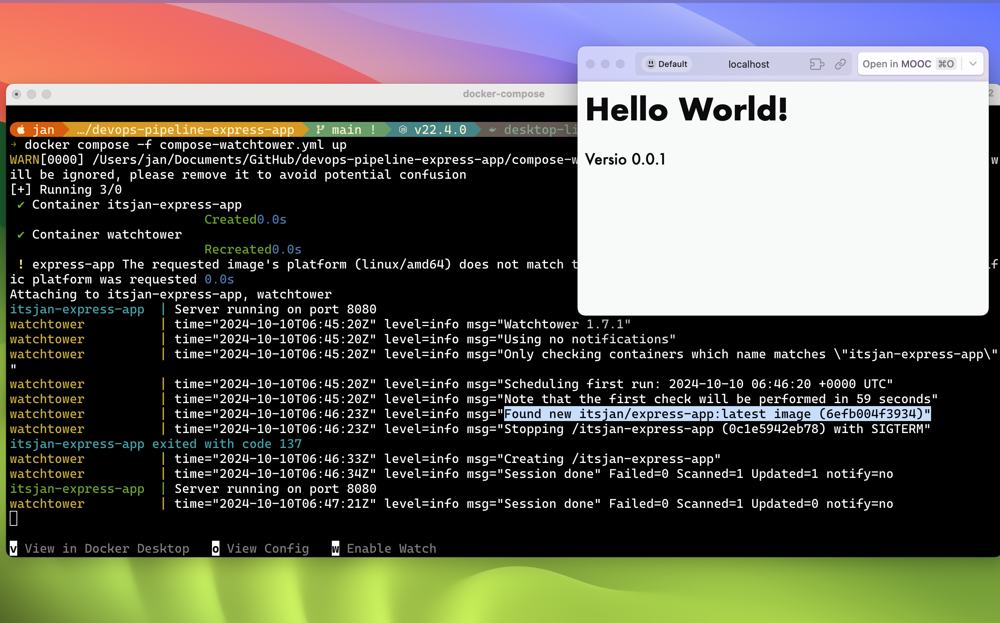
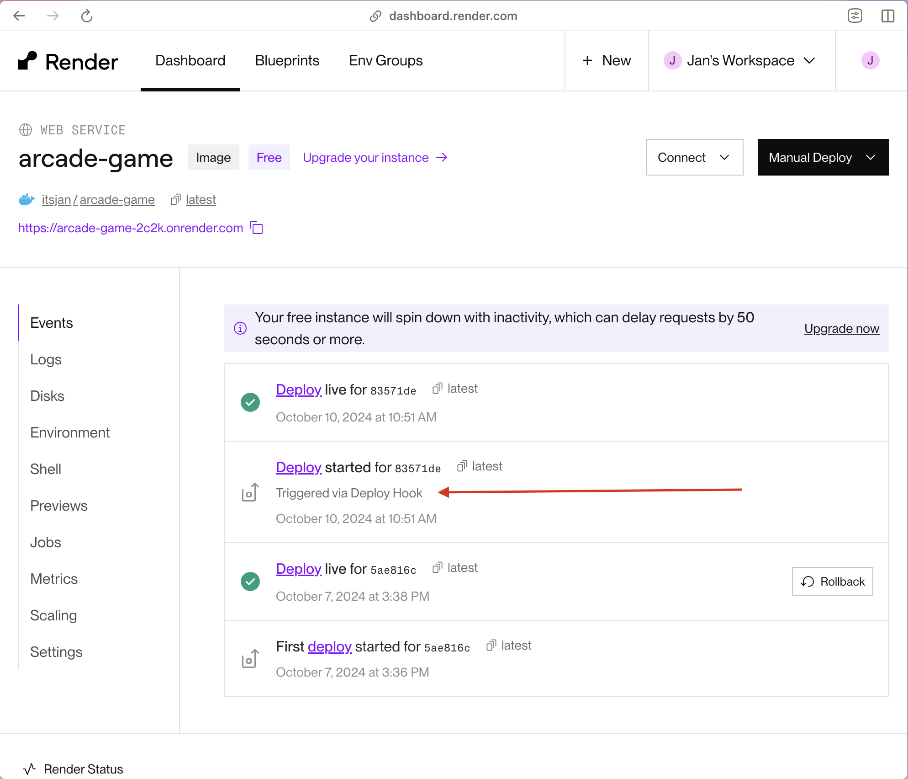

# DevOps with Docker - Exercises PART 3

## Deployment Pipelines

### Exercise 3.1: Your pipeline

**Solution**

Github repository: <https://github.com/itsjan/devops-pipeline-express-app/>



### Exercise 3.2: A deployment pipeline to a cloud service
In Exercise 1.16 you deployed a containerized app to a cloud service.

Now it is time to improve your solution by setting up a deployment pipeline for it so that every push to GitHub results in a new deployment to the cloud service.

You will most likely find a ready-made GitHub Action that does most of the heavy lifting your you... Google is your friend!

Submit a link to the repository with the config. The repository README should have a link to the deployed application.


**Solution**

Link to GitHub repo: <https://github.com/itsjan/P3-Arcade-Game>

Notes: 
Each Render service has a deploy hook URL you can use to trigger a deploy via a GET or POST request. Your service’s deploy hook URL is available from its Settings page on the [Render Dashboard](https://dashboard.render.com/).

<https://docs.render.com/deploy-an-image>




### Exercise 3.3: Scripting magic
Create a now script/program that downloads a repository from GitHub, builds a Dockerfile located in the root and then publishes it into the Docker Hub.

**Solution**


```bash
#!/bin/bash
# file builder.sh

if [ "$#" -ne 2 ]; then
    echo "Usage: $0 <github-repo> <docker-hub-repo>"
    exit 1
fi

REPO=$1
HUB_REPO=$2

TMP_DIR=$(mktemp -d)
git clone https://github.com/$REPO.git $TMP_DIR
cd $TMP_DIR
docker build -t $HUB_REPO .
docker push $HUB_REPO
```
